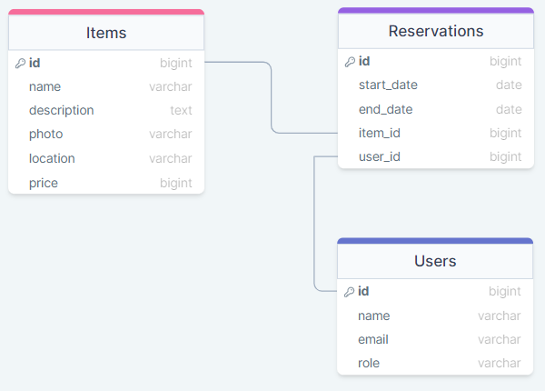

<a name="readme-top"></a>

<!-- <div align="center">
  
  <br/>

  <h3><b>Microverse README Template</b></h3>

</div> -->

# 📗 Table of Contents

- [📖 About the Project](#about-project)
  - [🛠 Built With](#built-with)
    - [Tech Stack](#tech-stack)
    - [Key Features](#key-features)
  - [🚀 Live Demo](#live-demo)
  - [📊 ERD Diagram](#erd-diagram)
- [💻 Getting Started](#getting-started)
  - [Setup](#setup)
  - [Prerequisites](#prerequisites)
  - [Install](#install)
  - [Usage](#usage)
  - [Run tests](#run-tests)
  - [Deployment](#deployment)
- [👥 Authors](#authors)
- [🔭 Future Features](#future-features)
- [🤝 Contributing](#contributing)
- [⭐️ Show your support](#support)
- [🙏 Acknowledgements](#acknowledgements)
- [❓ FAQ (OPTIONAL)](#faq)
- [📝 License](#license)

# 📖 Booking APIn <a name="about-project"></a>

**Booking API** is an back end application that allows users to create users, items and reservations.

## 🛠 Built With <a name="built-with"></a>

### Tech Stack <a name="tech-stack"></a>

<details>
  <summary>Client</summary>
  <ul>
    <li><a href="https://react.dev/">React</a></li>
  </ul>
</details>

<details>
  <summary>Server</summary>
  <ul>
    <li><a href="https://rubyonrails.org/">Ruby on Rails</a></li>
  </ul>
</details>

<details>
<summary>Database</summary>
  <ul>
    <li><a href="https://www.postgresql.org/">PostgreSQL</a></li>
  </ul>
</details>

### Key Features <a name="key-features"></a>

- **User account creation**
- **Add, update, delete items**
- **Add, update, delete items reservation**

<p align="right">(<a href="#readme-top">back to top</a>)</p>

## 🚀 Live Demo <a name="live-demo"></a>

> This project has no live demo, as it stands for the back-end part of the application

<!-- - [Live Demo Link](https://google.com) -->

<p align="right">(<a href="#readme-top">back to top</a>)</p>

## 📊 ERD Diagram <a name="erd-diagram"></a>

This is the base ERD diagram for this project



<p align="right">(<a href="#readme-top">back to top</a>)</p>

## 💻 Getting Started <a name="getting-started"></a>

To get a local copy up and running, follow these steps.

### Prerequisites

In order to run this project you need:

```sh
 gem install rails
```

### Setup

Clone this repository to your desired folder:

```sh
  git https://github.com/SergSkol/booking_api.git
  cd booking_api
```

### Install

Install this project with:

```sh
  bundle install
  rails db:create
  rails db:migrate
  rails db:seed
```

### Usage

To run the project, execute the following command:

```sh
  rails server
```

<!-- ### Run tests

To run tests, run the following command:

Example command:

```sh
  bin/rails test test/models/article_test.rb
``` -->

<p align="right">(<a href="#readme-top">back to top</a>)</p>

## 👥 Authors <a name="authors"></a>

👤 **Sergiy Shkolnik**
- GitHub: [SergSkol](https://github.com/SergSkol)
- Twitter: [@sps676](https://twitter.com/sps676)
- LinkedIn: [SergSkol](https://www.linkedin.com/in/sergskol/)

👤 **Eva-Lavinia Bucur**
- GitHub: [@BucurEva87](https://github.com/BucurEva87)
- Twitter: [@BucurEva](https://twitter.com/BucurEva)
- LinkedIn: [Eva-Lavinia Bucur](https://www.linkedin.com/in/eva-lavinia-bucur)

<p align="right">(<a href="#readme-top">back to top</a>)</p>

## 🔭 Future Features <a name="future-features"></a>

> Describe 1 - 3 features you will add to the project.

- [ ] **Project presentation**
- [ ] **More units and integration tests**
- [ ] **More photos for item**

<p align="right">(<a href="#readme-top">back to top</a>)</p>

## 🤝 Contributing <a name="contributing"></a>

Contributions, issues, and feature requests are welcome!

Feel free to check the [issues page](../../issues/).

<p align="right">(<a href="#readme-top">back to top</a>)</p>

## ⭐️ Show your support <a name="support"></a>

If you like this project, please give us a star. It would (and will) be highly appreciated!

<p align="right">(<a href="#readme-top">back to top</a>)</p>

## 🙏 Acknowledgments <a name="acknowledgements"></a>

I would like to thank the Rails community for giving us extensive documentation!

<p align="right">(<a href="#readme-top">back to top</a>)</p>

<!-- LICENSE -->

## 📝 License <a name="license"></a>

This project is [MIT](./LICENSE) licensed.

<p align="right">(<a href="#readme-top">back to top</a>)</p>
